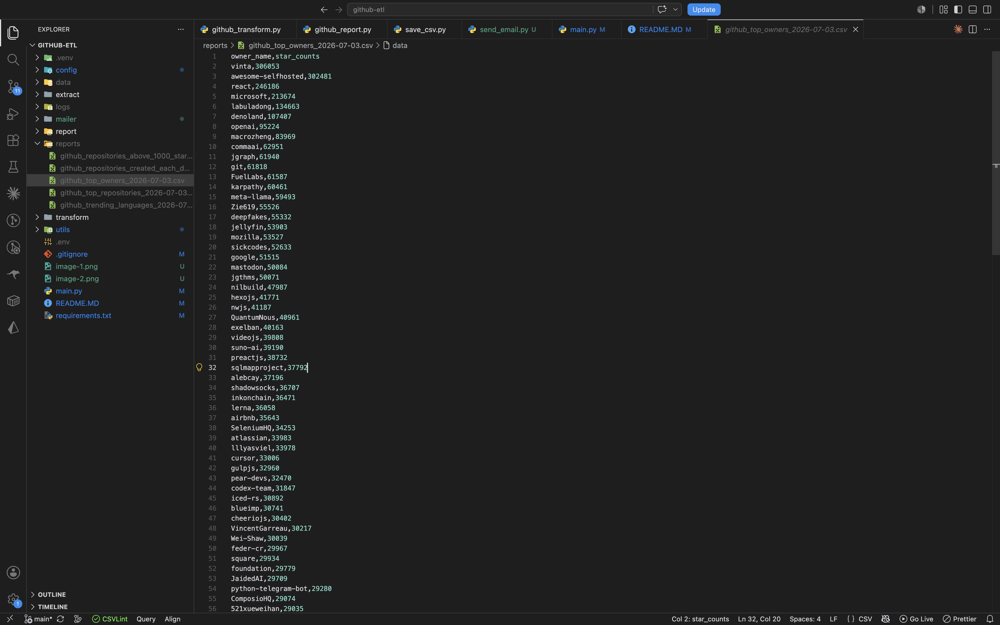
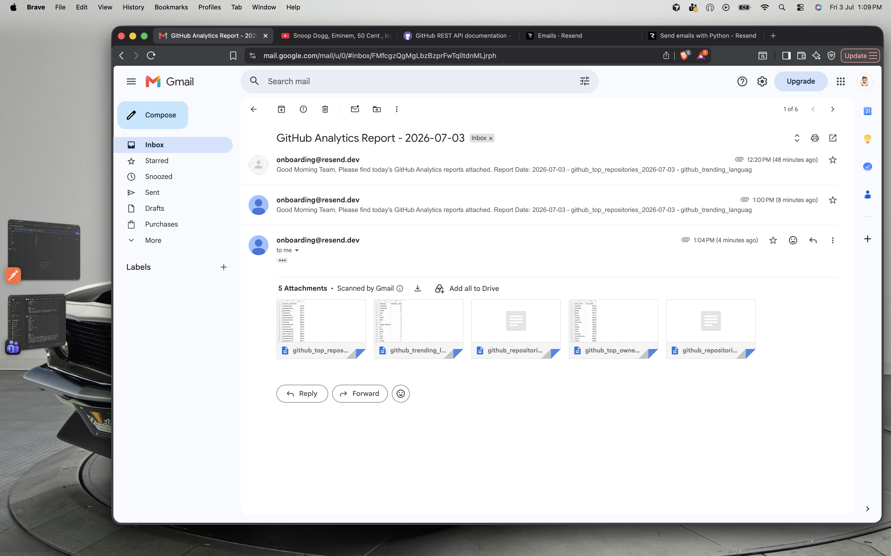
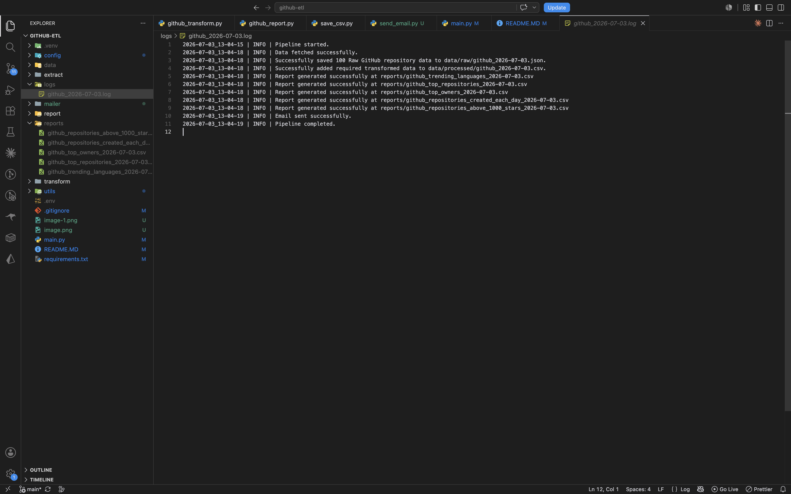

# GitHub Analytics ETL Pipeline

An automated ETL pipeline that extracts trending GitHub repository data, transforms it into a clean dataset, generates business reports, and emails them automatically every day.

---

## Project Overview

This project was built to automate the daily reporting process for an Analytics Team.

Instead of manually downloading GitHub data and creating reports, the pipeline:

- Fetches latest GitHub repositories
- Cleans & transforms the data
- Generates multiple business reports
- Stores raw & processed datasets
- Emails reports automatically
- Runs every day at 11:00 AM using Cron

---

# Business Requirement

The Analytics Team wants daily reports answering the following questions:

1. Which programming languages are trending?
2. Which repositories are getting the most stars?
3. Which owners created the most popular repositories?
4. How many repositories were created each day?
5. Which repositories crossed 1000 stars?

---

# Tech Stack

- Python
- Pandas
- Requests
- Pathlib
- Resend API
- Cron (macOS)
- dotenv

---

# Project Structure

```
github-etl/
│
├── config/
├── extract/
├── transform/
├── report/
├── email/
├── utils/
│
├── data/
│   ├── raw/
│   └── processed/
│
├── reports/
├── logs/
│
├── main.py
├── requirements.txt
└── README.md
```

---

# ETL Workflow

```
GitHub API
      │
      ▼
Extract Data
      │
      ▼
Save Raw JSON
      │
      ▼
Transform Data
      │
      ▼
Save Processed CSV
      │
      ▼
Generate Business Reports
      │
      ▼
Email Reports
      │
      ▼
Scheduled Daily using Cron
```

---

# Reports Generated

Every execution generates the following reports:

- Trending Programming Languages
- Top Starred Repositories
- Top Repository Owners
- Repositories Created Each Day
- Repositories Above 1000 Stars

---

# Features

- Extracts latest GitHub repositories
- Stores raw JSON data
- Creates cleaned dataset
- Generates 5 analytical reports
- Automatic logging
- Environment variable support
- Dynamic CSV attachments
- Sends email automatically
- Scheduled daily execution

---

# Environment Variables

Create a `.env` file.

```env
RESEND_API_KEY=your_api_key
RESEND_FROM=onboarding@resend.dev
RESEND_TO=your_email@gmail.com
```

---

# Installation

```bash
git clone https://github.com/yourusername/github-etl.git

cd github-etl

python -m venv .venv

source .venv/bin/activate

pip install -r requirements.txt
```

---

# Run

```bash
python main.py
```

---

# Cron Job

Runs every day at **11:00 AM**

```cron
0 11 * * * cd /Users/apple/Desktop/github-etl && /Users/apple/Desktop/github-etl/.venv/bin/python main.py >> /Users/apple/Desktop/github-etl/logs/cron.log 2>&1
```

---

# Screenshots

## Generated Reports


---

## Email Received


---

## Logs


---

# Sample Report

| Language | Repository Count |
|-----------|-----------------:|
| JavaScript | 27 |
| Java | 10 |
| Ruby | 9 |
| Python | 6 |
| Go | 5 |

---

# Future Improvements

- Docker support
- GitHub Actions CI/CD
- Better exception handling
- Unit testing
- Cloud deployment
- Multiple ETL pipelines
- HTML email template
- Dashboard integration

---

# Author

**Deepesh Sabran**

Built as part of an end-to-end Data Engineering learning journey.